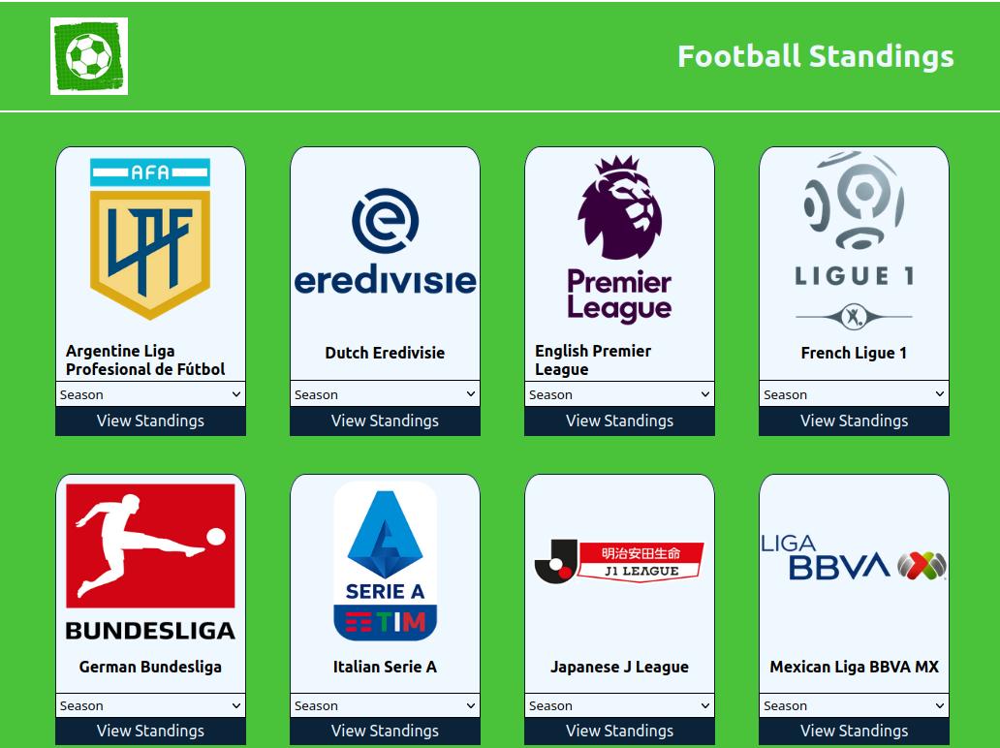

# Football Standings

> "Football Standings" is a website for Football fans. It is a fairly simple website which displays the fooball standings of a number of leagues over a number of Years
  By building this project, I build on my experiance with React, React-Redux, jest, React-routers and Middleware such as Thunk. 

## Built With

- Html, CSS, Javascript
- React, Redux, Thunk
- Webpack, Jest, Gitflow

## Live Demo

[Live Demo Link](https://football-standings-lockless404.netlify.app/)

## Video

[Check out this video of me trying to explain my website](https://www.loom.com/share/0fa75745199443b69cedeef365093656)

## Getting Started

To get a local copy up and running in your machine:

    1.Clone this repo or download the zip folder:

      git clone https://github.com/Lockless404/dotaCapstone.git

    2.Navigate to the location of the folder in your machine:

      you@your-Pc-name:~$ cd <folder>

    3.Install all the dependencies:

      npm install

    4.Run app in your local browser:

      npm start

## Authors

👤 **Hamza Tarar**

- GitHub: [@Lockless404](https://github.com/Lockless404)
- Twitter: [@hamza_tarar10](https://twitter.com/hamza_tarar10)
- LinkedIn: [Hamza Tarar](https://www.linkedin.com/in/hamzaalitarar/)

## Acknowledgements

- Original design idea by [Nelson Sakwa](https://football-standings-lockless404.netlify.app/) on Behance.

## 🤝 Contributing

Contributions, issues, and feature requests are welcome!

Feel free to check the [issues page](../../issues/).

## Show your support

Give a ⭐️ if you like this project!

## 📝 License

This project is [MIT](./MIT.md) licensed.
